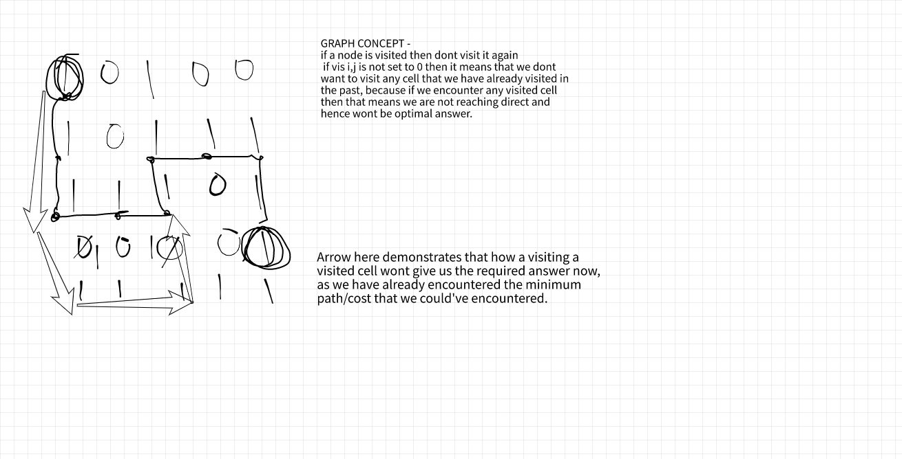

__IMPORTANT__ - for questions that are based on visiting places/cells,
mainly there are four approaches used, if n is number of cells (length * breadth)
1. Backtracking for `o(pow(2,n))` - (we set visited to false at the end to backtrack, uusually in questions where we have to find all possible paths)
    - Rat in a maze
    - N-Queens
2. Graph/ DFS for `o(n)` - (we dont set visited to false at the end, usually when we have to find minimum path bec then we know first time visiting a cell is the shortest path - [whole reason explained below](#important-problems))
    - [Size of the largest region in Boolean Matrix](https://www.geeksforgeeks.org/find-length-largest-region-boolean-matrix/)
3. Graph/ BFS for `o(n)` - (when you want to process parallely) OR (same as above, but when dfs might take infinite time, we use bfs)
    > ek jagah sey dusri jagah tak pahuchne ke liye, bfs is better than dfs kyuki ham har cells pe ye find kar rahe honge ki waha tak sabsey minimum time mai kaise pahoch sktey hai

    > 'q' mai agar x,y already jaa chuka hai tou mtlb yahi minimum time hai uske liye
    - [Rotten Oranges](graphs/9_rotten_oranges.cpp) (for processing parallely)
    - [Shortest Path in a Binary Matrix](https://www.codingninjas.com/codestudio/guided-paths/data-structures-algorithms/content/118511/offering/1381547?leftPanelTab=0) (above said reason)
    - knight's tour (above said reason)
        ```cpp
        /*
        while dealing with logic of BFS and "parallely processing",
        queues should be used to process the elements, and
        get the size of the queue and then in one iteration process the elements till these size 
        */
        while(!q.empty()){
            int size = q.size();
            while(size--) { /* */ }
        }
        ```
4. Dynamic Programming for `o(n)` - (unclear rn)

<hr>

### Standard Problems on Graph
- [Pointers](pointers.cpp)
- **[Graph Theory](https://www.programiz.com/dsa/graph)** - [Basic Code](graphs/1_basic.cpp)
- [Depth First](graphs/2_dfs_bfs.cpp)
- [Breadth First](graphs/2_dfs_bfs.cpp)
- __Print strongly connected components__
    - __for Undirected?__ basic dfs and then check visited array 
    - __for Directed?__ [Kosaraju Algorithm](graphs/kosaraju.md)
- [__Cycle in graph__](graphs/5_union-find.md)
    - __for Undirected? aka Is graph tree or not__
    - __for Directed? aka Is graph cyclic or not__ - Disjoint Set/ Union Find


### Famous Algos
- [Kruskal's Algo](graphs/5_kruskal.cpp)
    - for MST 
    - `in o(e loge)`, log e is or findparent() and e means edges
    - just sort edges and then apply union-find for E-1 edges same as above
- ?? [Prims's Algo](graphs/6_prims.cpp)
    - for MST
- ?? [Dijkstra](graphs/7_dijkstra.cpp) - shortest path between any two nodes in a graph but +ve
    - the notes must be positive and no-negative-cycles
    - the code is same as prim's only the relaxation is updated
    - for prims it was `weight[v] > graph[u][v]`, where we are checking Node_V->B is better or previousNode->B
    - for dijsktra it is, `weight[u] != INT_MAX && weight[v] > weight[u] + graph[u][v]`, where first we are checking the current node is not infinity and then relax it.
- Floyd's Warshall 
    - shortest path between any two nodes in a graph 
    - weights can be +ve -ve, both
    - relaxation logic is `dij = min(dij, dik + dkj), for k=1ton, i=0ton and j=0ton`
- Topological Sorting
    - for Directed Acyclic Graph
    - NOTE : Topological Sorting for a graph is not possible if the graph is not a DAG (which means if there's a cycle or undirected graph then not possible).
    - Method 1 - [Khan's Algorithm](graphs/8_topological.cpp) : use array to store the indegree of each node and then remove if any indegree becomes 0, push it to queue. The queue will run e times (edges) and the former array will run n times (nodes). hence `o(n+e)` 
    - Method 2 - If indegree is not 0 for any node : same as used in kosaraju to find the order of nodes
        ```cpp
        dfs()                                   // o(n)
            visited[u] = true;
            for(auto v: adj[u])                 // o(e)
                if(!visited[v]) dfs(v);
            st.push(u);                         // hence o(n+e)
        ```

### Important Problems
- [Graph coloring](graphs/5_graph_coloring.cpp)
- [Size of the largest region in Boolean Matrix](https://www.geeksforgeeks.org/find-length-largest-region-boolean-matrix/)
- [Rotten Oranges](graphs/9_rotten_oranges.cpp) ; similar logic for [Shortest Path in Binary Matrix](https://www.codingninjas.com/codestudio/guided-paths/data-structures-algorithms/content/118511/offering/1381547?leftPanelTab=3)
- ___Rat in a maze (backtracking -dfs) vs Min Steps to reach target (graph -dfs)___
    - In rat in a maze, we have to find all the paths and hence backtracking is only option.
    - [MUST!! read code for rat maze (space optimized)](backtracking/2_rat_maze.cpp)
    - In Min Steps to reach target, Naive approach is that we can backtrack and hence O(pow(2, n)) complexity.
    - But we also know that there's no need to traversing all the paths because the moment we reach the target, we found the minimum steps.
    - HOW?? it is only logical because if we are reaching first then its the direct direction (if bfs, queue mai pehle encounter kar rahe hai), else we are forming loop for no reason (if bfs, queue mai second time encounter kar rahe hai, which means is baar jaada time laga aane mai).
    - AND HENCE, no need to set visited[i,j] as false
    - [MUST!! read code for min steps to reach target]((graphs/11_min_steps_reach_target.cpp))
- [Min steps by knight](graphs/10_steps_knights.cpp) - it is kinda similar but not possoble with dfs but why?? 
    - because unlike tree, a graph dfs traversal can be a bit lengthy (depending upon the question). 
    - We have to use BFS here because BFS works in parallel for all the approachable path
    - so whenever we reach the destination with any path then ___that first path will always be minimum.___ 
    - And this is why we have to use BFS as it works in parallel. 
    - And we can not use DFS here because with DFS we will keep on moving in depth till we either reach the destination or we visit all the cells and no more cells to visit. 
    - ___And so then we will backtrack and then we will try another path and with that another path suppose we are able to reach then we can not be sure that this is path is minimum path only.___ 
    - Because DFS does not work in parallel. And so if we are using DFS then we have to use traverse all the possible paths and then only we can select minimum out of all of them. But with BFS first path with which we reach destination is always be the minimum path.
- [Min cost to destination](graphs/12_min_cost_dest.cpp)
    - why visited is set to 1 but never switched back to 0??? 
    - and iknow its not backtracking if we not resetting to 0, but then why not backtrack? its graph, the concept of graph is to traverse the nodes only once.
    - also, the order of recursive call matters, maybe thats why?

